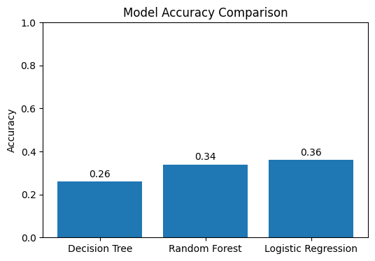
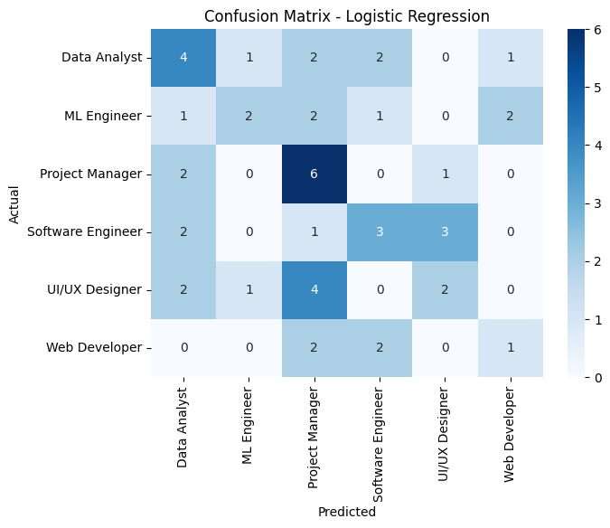
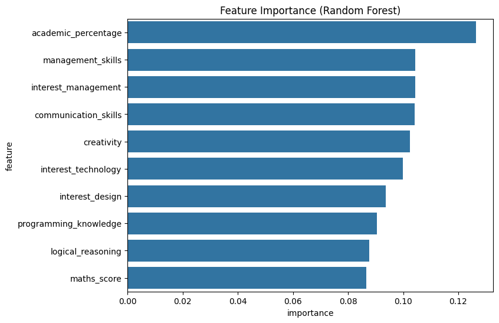

# 🎯 Career Recommendation System using Machine Learning

A Machine Learning–based system that predicts the most suitable career for a student based on skills, academic performance, and interests using classification algorithms.

---

## 📌 Project Description

Choosing the right career is a critical decision for students.  
This project uses Machine Learning models to analyze student attributes and recommend an appropriate career path.

Multiple classification models are trained and evaluated, and the best-performing model is selected based on accuracy.

This project is developed for academic learning and portfolio demonstration purposes.

---

## 🧠 Machine Learning Models Used

- Decision Tree Classifier  
- Random Forest Classifier  
- Logistic Regression (Multiclass)

---

## 📊 Dataset Information

- Dataset Type: Synthetic (Dummy data generated using NumPy)
- Total Samples: 250
- Target Variable: career

### Career Classes

- Software Engineer  
- Data Analyst  
- Web Developer  
- ML Engineer  
- UI/UX Designer  
- Project Manager  

---

## ⚙️ Features Used

- logical_reasoning  
- programming_knowledge  
- maths_score  
- communication_skills  
- creativity  
- management_skills  
- academic_percentage  
- interest_technology  
- interest_management  
- interest_design  

---

## 🔁 Project Workflow

1. Generate synthetic student data  
2. Assign career labels using rule-based logic  
3. Split data into training and testing sets  
4. Train multiple Machine Learning models  
5. Evaluate models using accuracy and classification report  
6. Compare model performance  
7. Select the best-performing model  
8. Predict career for a new student  

---

## 📈 Model Evaluation

- Accuracy comparison of models  
- Classification report  
- Confusion matrix  
- Feature importance using Random Forest  

---

## 🔮 Sample Output

Recommended Career: Software Engineer  
Confidence Score: 92.34%

---

---

## 🖼 Output Screenshots

### Model Accuracy Comparison

### Confusion Matrix

### Feature Importance (Random Forest)

### Sample Career Prediction

---

## 🛠 Technologies Used

- Python  
- Pandas  
- NumPy  
- Scikit-learn  
- Matplotlib  
- Seaborn  

---

## 🚀 How to Run the Project

1. Clone the repository

    git clone https://github.com/saarthakmathur/Career-Recommendation-System.git  
    cd Career-Recommendation-System  

2. Install dependencies

    pip install -r requirements.txt  

3. Run the project

    python career_prediction.py  

You can also run the Jupyter Notebook version if available.

---

## 📌 Future Improvements

- Use real-world student datasets  
- Add Deep Learning models  
- Build a web interface using Flask or Streamlit  
- Improve prediction confidence calibration  
- Add more career categories  

---

## ⚠️ Disclaimer

This project uses synthetic data and is intended for educational and portfolio purposes only.  
Predictions should not be considered real career advice.

---

## 👤 Author

Saarthak Mathur  

